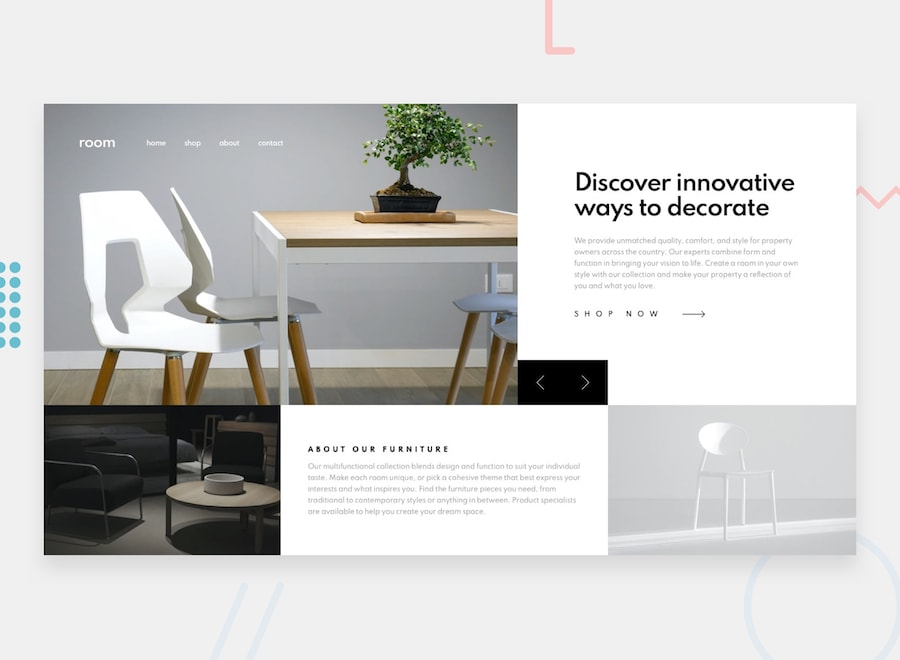
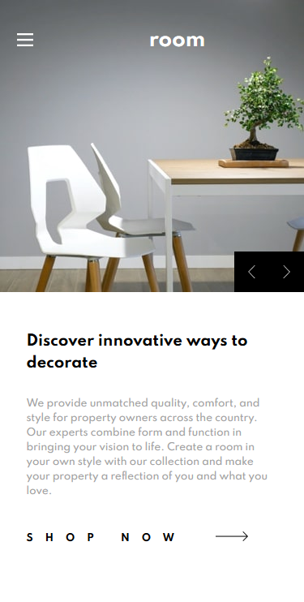

# Frontend Mentor - Room homepage
Design preview                                                                          | Completed Layout
:--------------------------------------------------------------------------------------:|:------------------------------------------------------------:
 | 

## Welcome! 👋

Thanks for checking out my solution to the front-end coding challenge from [Frontend Mentor](https://www.frontendmentor.io).

I obtained the documetation with the design layout and my task was to build out this e-commerce homepage and get it looking as close to the design as possible. I have icluded this below. The layout was accomplished with the CSS3 flexbox layout model.

**To do this challenge, you need a basic understanding of HTML, CSS and JavaScript.**

## The requirements

Use any tools you like to help you complete the challenge.

Users should be able to:

- View the optimal layout for the site depending on their device's screen size
- See hover states for all interactive elements on the page
- Navigate the slider using either their mouse/trackpad or keyboard

## Where to find everything

Your task is to build out the project to the designs inside the `/design` folder. You will find both a mobile and a desktop version of the design to work to.

The designs are in JPG static format. This will mean that you'll need to use your best judgment for styles such as `font-size`, `padding` and `margin`. This should help train your eye to perceive differences in spacings and sizes.

You will find all the required assets in the `/images` folder. The assets are already optimized.

There is also a `style-guide.md` file, which contains the information you'll need, such as color palette and fonts.

## Building your project

Feel free to use any workflow that you feel comfortable with. Below is a suggested process, but do not feel like you need to follow these steps:

1. Initialize your project as a public repository on [GitHub](https://github.com/). This will make it easier to share your code with the community if you need some help. If you're not sure how to do this, [have a read through of this Try Git resource](https://try.github.io/).
2. Configure your repository to publish your code to a URL. This will also be useful if you need some help during a challenge as you can share the URL for your project with your repo URL. There are a number of ways to do this, but we recommend using [Vercel](https://bit.ly/fem-vercel). We've got more information about deploying your project with Vercel below.
3. Look through the designs to start planning out how you'll tackle the project. This step is crucial to help you think ahead for CSS classes that you could create to make reusable styles.
4. Before adding any styles, structure your content with HTML. Writing your HTML first can help focus your attention on creating well-structured content.
5. Write out the base styles for your project, including general content styles, such as `font-family` and `font-size`.
6. Start adding styles to the top of the page and work down. Only move on to the next section once you're happy you've completed the area you're working on.
7. If you'd like to try making your project fully responsive, we'd recommend checking out [Sizzy](https://bit.ly/fm-sizzy). It's a great browser that makes it easy to view your site across multiple devices.

**Have fun building!** 🚀

## Section overview
These are the comparisons of the provided layouts and the results on mobile.

Design preview                    | Phone Layout                      | Lower-section                        | Navbar
:--------------------------------:|:---------------------------------:|:------------------------------------:|:------------------------------:
 |  |   | 
